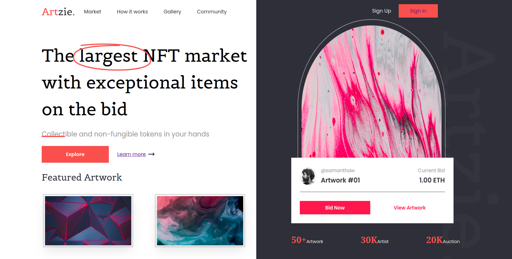

# Artzie - NFT Marketplace Layout 🚀

Este es un proyecto de práctica de maquetación avanzada realizado como parte de mi formación en **Conckerblock**. El objetivo fue crear una interfaz de Marketplace de NFTs moderna, utilizando una arquitectura de diseño limpia y eficiente.

## 📸 Preview
 

## 🛠️ Tecnologías y Desafíos
* **HTML5 Semántico:** Estructura optimizada para accesibilidad.
* **CSS Grid Layout:** Implementación de un sistema de rejilla de dos columnas (`.izq` y `.der`) con áreas personalizadas.
* **Posicionamiento Absoluto:** Manejo de capas (`z-index`) para crear efectos visuales con el título vertical y el lienzo de arte.

## 🛡️ Enfoque en Ciberseguridad
Como estudiante interesado en la **Ciberseguridad**, este proyecto sigue buenas prácticas de:
1. **Orden de archivos:** Separación clara entre archivos de código fuente y activos públicos.
2. **Optimización de activos:** Uso de formatos SVG para evitar la carga de scripts maliciosos ocultos en metadatos de imágenes pesadas.
3. **Mantenimiento:** Código comentado y estructurado para facilitar auditorías visuales.

## 🚗 Otros Proyectos
Actualmente desarrollando **Movilidad Sur**, un servicio de traslados personalizado para la Costa de Oro (Solymar, Lagomar, El Pinar), especializado en la atención de adultos mayores con un vehículo Onix 2017.

---
Creado por Jorge Cao - Estudiante de Programación y Ciberseguridad.
Linkeding:
